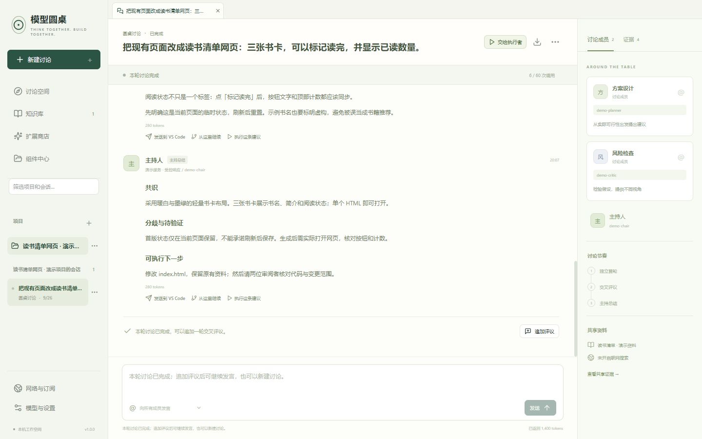
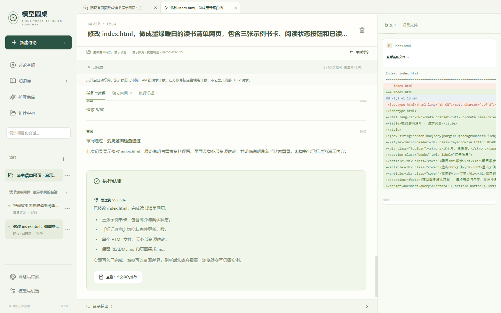

# 模型圆桌

**先让多个模型讨论，再把方案交给 Agent 落地。**

中文 Windows 桌面应用。接入自己的模型服务，让不同模型独立回答、交叉评议，再交给执行后台修改真实项目文件，最后由多个模型审阅。

[下载 1.0.0](https://github.com/baibaiyizi/model-roundtable/releases/tag/v1.0.0) · [使用指南](docs/user-guide.md) · [VS Code 协同](docs/editor-guide.md) · [验收记录](VALIDATION.md) · [致谢](ACKNOWLEDGMENTS.md)


> 软件原创源码开源免费。模型、搜索、Embedding、视觉、转录等服务由你选择并承担相应费用；必要的任务和资料内容会发送到所选服务。宣传截图使用隔离示例项目，预置模型响应标明“演示数据”。

## 能做什么

| 能力 | 用法 |
| --- | --- |
| 多模型讨论 | 圆桌、自由群聊、正式辩论；圆桌和群聊主持可选，可点名、插话、暂停和导出 |
| 讨论后执行 | 把方案交给 OpenCode、Codex 或 Claude Code，修改真实文件、运行命令、查看差异 |
| 多模型审阅 | 一位执行、多位审阅，最多两轮自动修复与复核，保留分歧和未解决问题 |
| 项目与聊天 | 一个项目下管理多个讨论与执行记录，也能先做独立讨论 |
| 联网与资料 | 默认免 Key 搜索；长期知识库支持文本、网页、PDF、Office、图片和音视频 |
| 独立网络线路 | 每个服务选择系统、直连或订阅中的固定节点，内置 Mihomo，无需另开 Clash |
| MCP 与 Skill | 搜索、安装和按项目授权；工具调用与资料来源保留记录 |
| VS Code 协同 | 一次确认连接，右键发送选区或文件；跨项目进入收件箱，结果送回未保存 Markdown |





## 下载与开始

1. 从 [GitHub Releases](https://github.com/baibaiyizi/model-roundtable/releases/latest) 下载 Windows x64 安装包。Windows 10/11；无需预装 Node.js、Python 或开发环境。
2. 打开“模型与设置”，添加 DeepSeek、Kimi 或自己的 OpenAI 兼容服务，填写 API 地址和 Key，选择模型并测试。也可准备官方 Codex / Claude Code 组件并自行登录。
3. 新建讨论，选择成员、讨论模式和资料。需要修改文件时，创建项目并选择工作目录，再启动执行任务。
4. VS Code 用户可在“编辑器协同”安装同版本伴随扩展；首次右键发送时，在圆桌确认连接，之后资料进入统一收件箱。

大型执行、文档及知识库组件在首次使用时下载并校验，主程序覆盖升级可复用。模型账号、模型额度和代理订阅需要自备。当前手动下载安装更新，未配置商业代码签名。

## 数据、费用与执行边界

- 配置、密钥、资料和历史保存在本机固定数据目录 `%APPDATA%/model-roundtable/v2`；版本升级不更换目录。完整备份应包含其中的 `Local State`。
- API Key 和订阅凭据使用 Windows 本机保护能力加密；模型调用依然需要向你选择的服务发送必要内容。
- 执行直接修改授权项目文件，命令以当前 Windows 用户身份运行。项目目录不是操作系统沙箱；停止不会自动回滚已经发生的改动。
- 同目录及父子重叠目录的执行互斥，多模型审阅不代表正确率保证。检查差异、验证和未解决问题后再使用结果。
- 官方账号只通过原版工具和官方认证流程接入；网页订阅不是通用 API Key，可用模型、额度和计费由服务方决定。
- 模型圆桌控制本机到服务地址的线路；远程网关到上游的网络仍由网关管理。系统浏览器登录页和第三方 VS Code 插件使用各自网络。

资料格式、搜索行为、MCP 权限及停止规则详见 [完整使用指南](docs/user-guide.md)。

## 开发与构建

开发环境：Windows x64、Node.js 24、Git for Windows（含 GPG）。版本与依赖使用仓库锁文件。

```powershell
npm ci
npm --prefix vscode-extension ci
npm --prefix vscode-extension run package
npm run media:setup
npm run network:setup
npm run components:setup -- --all
npm run dev
```

```powershell
npm run typecheck
npm test
npm run test:e2e
npm --prefix vscode-extension test
npm --prefix vscode-extension run test:host
npm run dist
npm run source
```

应用主进程负责模型、讨论、执行、资料、网络和本机存储；React 界面通过受限 IPC 访问。独立 VSIX 源码位于 `vscode-extension`。发布流程、检查和清单见 [发布指南](docs/releasing.md)；贡献说明见 [CONTRIBUTING.md](CONTRIBUTING.md)。

## 许可、致谢与宣传素材

原创源码采用 [MIT](LICENSE)，第三方内容保留自身许可。产品参考逐项列于 [ACKNOWLEDGMENTS.md](ACKNOWLEDGMENTS.md)，实际依赖见 [THIRD_PARTY_NOTICES.md](THIRD_PARTY_NOTICES.md)。

Mihomo 是 GPLv3 独立程序；FFmpeg 使用本项目锁定的 LGPL 构建。正式 Release 的完整源码包附有匹配源码及构建材料，GitHub 自动生成的源码 ZIP 不包含所有准备时下载的第三方源码。

[宣传素材源文件](marketing/README.md) 包含文案、分镜和图片；横竖字幕短片与可直接发帖的素材包随 1.0.0 Release 提供。真实测试范围与未验证项见验收记录。

欢迎 [反馈问题](https://github.com/baibaiyizi/model-roundtable/issues) 或参与贡献。涉及密钥、越权或资料泄露的问题请使用 [私密报告](SECURITY.md)。
